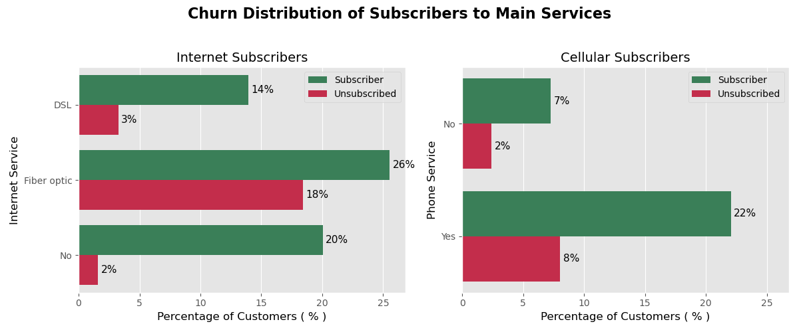
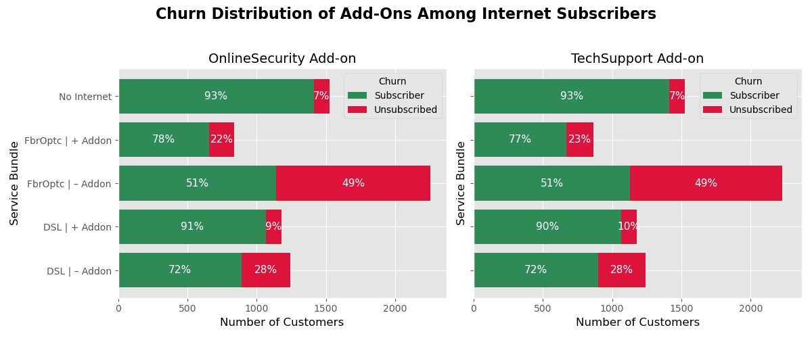
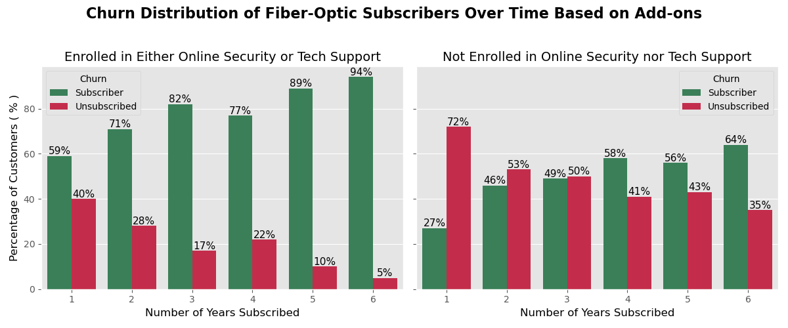

# Predicting Churn and Retaining Telco Subscribers


*Titled: Futuristic smart city with 5G global network technology by Rawpixel.com*

## Overview

`Customer churn` is a critical issue for telecom companies, as retaining existing customers is often more cost-effective than acquiring new ones. This project aims to build and evaluate models that predict customer churn using the `Telco Customer Churn` dataset. By understanding the factors that influence churn, the company can implement strategies to improve customer retention.

As a data scientist, my goal is to analyze the dataset, develop predictive models, and provide actionable insights to help the company reduce churn rates and enhance customer satisfaction.

Analysis by Kawsar Hussain

## Challenge

Our goal is to predict customer churn and provide actionable recommendations to boost business revenue. Using the Telco Customer Churn dataset, we identify `key factors influencing churn and suggest strategies to enhance retention`. Our evidence-based recommendations aim to deliver tangible benefits for the company.

## Datasets

In the folder `data`, we have a dataset from:

- [Kaggle, Telco Customer Churn](https://www.kaggle.com/blastchar/telco-customer-churn)

## Solution

This project builds `predictive churn models using Logistic Regression and Decision Trees`. By comparing their performance through metrics like accuracy and ROC-AUC, focusing on `Recall` we identify the best model for predicting customer churn. The insights gained will help inform strategies to improve customer retention and reduce churn rates.

## Results

### 1. Address High Churn Rates in Fiber-Optic Internet Service

`Insight:` A significant proportion of churn occurs among customers subscribed to InternetService, with Fiber-optic service experiencing higher churn rates than DSL.

`Recommendation:` Investigate the underlying issues with the Fiber-optic service to reduce churn. In the interim, offer Tech Support and Online Security add-ons to customers nearing the $75 monthly charge to help retain them.



### 2. Promote Add-On Services to Reduce Churn

`Insight:` Customers enrolled in add-on services such as OnlineBackup, OnlineSecurity, DeviceProtection, and TechSupport have lower churn rates.

`Recommendation:` Encourage subscriptions to these add-ons, especially for customers who are at risk of churning, to improve retention rates.



### 3. Target Customers with High Monthly Charges on Monthly Contracts

`Insight:` Customers with high monthly charges on MonthlyContract, particularly those with bills over $75, are among the most likely to churn.

`Recommendation:` Monitor these customers closely and provide targeted offers or discounts to retain them, focusing on those with charges between `$56-$75`, where churn rates start to increase.



## Conclusion

- #### Investigate and address issues with Fiber-optic service to reduce high churn rates.

- #### Encourage subscriptions to add-on services to lower churn.

- #### Monitor customers with high monthly charges nearing $75 on month-to-month contracts and offer targeted retention strategies.

## Next Steps

- #### `Improve current models` by tuning hyperparameters further for better performance.
- #### `Test different models`, specifically Random Forest, to explore alternative approaches.
- #### `Investigate` the reasons behind customer churn at `higher monthly charges` and identify other contributing variables.

## Repository Structure

```
├── data
│   ├── clean_telco_churn.csv
│   ├── encoded_telco_churn.csv
│   ├── telco_customer_churn.csv
├── models
│   ├── dtree_base.pkl
│   ├── dtree_tune.pkl
│   ├── logreg_base.pkl
│   ├── logreg_tune.pkl
├── notebooks
│   ├── data_cleaning.ipynb
│   ├── exploratory_data_analysis.ipynb
│   ├── model_development.ipynb
│   ├── model_evaluation.ipynb
├── LICENSE
├── README.md
├── telco_customer_churn.pdf
```